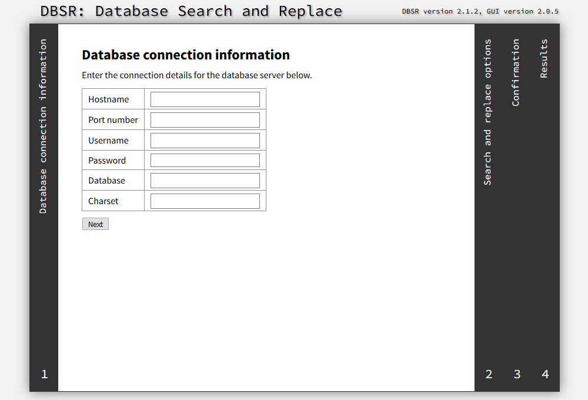

# DBSR: Database Search & Replace

DBSR provides functionality for committing search-and-replace-operations on
MySQL databases. It's main advantage above using a simple REPLACE()-SQL
statement is the support for parsing PHP serialized strings, which are commonly
used in for example WordPress databases.

Since DBSR does its own parsing of serialized strings, it is also able to repair
corrupted serializations, a problem often seen when less advanced search-replace
scripts were used before on the same database.

## Requirements
Minimum supported PHP version is 5.3 and is tested with versions up to 7.1. PDO
is used for connecting with the database, so make sure you have the `pdo` and
`pdo_mysql` extensions enabled.

## Usage
First, head over to [the releases page](https://github.com/DvdGiessen/DBSR/releases)
and download the latest version of DBSR.

You can either download the CLI version which you can use from the command
line, or the GUI version which can be uploaded to a webserver and accessed
through a web browser.

*Note:* Some tutorials make you download this entire repository and put it on
your web server. I do not recommend this. For most users, just downloading the
GUI version ([DBSearchReplace-GUI.php](https://github.com/DvdGiessen/DBSR/releases))
and uploading that to your web server is the recommended way to use DBSR.

### GUI version


The GUI of DBSR provides a simple to use, 4 step wizard for performing search
and replace operations on your database. It has a number of handy features for
auto-detecting and completing your settings, offering some automated checks to
help prevent common mistakes, and the ability to delete itself after you've
completed all your work.

### CLI version
Usage of the CLI version is best explained by the built-in `--help` output:

```
Usage: DBSearchReplace-CLI.php [options] -- SEARCH REPLACE [SEARCH REPLACE...]
       DBSearchReplace-CLI.php --file FILENAME

CLI options:
    --help                                  display this help and exit
    --version                               print version information and
                                            exit
    --file FILENAME                         JSON-encoded config file to load
    --output text|json                      output format (default: text)
PDO options:
    --host HOSTNAME                         hostname of the MySQL server
    --port PORTNUMBER                       port number of the MySQL server
    --user USERNAME                         username used for connecting to
                                            the MySQL server
    --password PASSWORD                     password used for connecting to
                                            the MySQL server
    --database DATABASE                     name of the database to be
                                            searched
    --charset CHARSET                       character set used for
                                            connecting to the MySQL server
DBSR options:
    --case-insensitive [true|false]         use case-insensitive search and
                                            replace (default: false)
    --extensive-search [true|false]         process *all* database rows
                                            (default: false)
    --search-page-size SIZE                 number of rows to process
                                            simultaneously (default: 10000)
    --var-match-strict [true|false]         use strict matching
                                            (default: true)
    --floats-precision PRECISION            up to how many decimals floats
                                            should be matched (default: 5)
    --convert-charsets [true|false]         automatically convert character
                                            sets (default: true)
    --var-cast-replace [true|false]         cast all replace-values to the
                                            original type (default: true)
    --db-write-changes [true|false]         write changed values back to the
                                            database (default: true)
    --handle-serialize [true|false]         interpret serialized strings as
                                            their PHP types (default: true)
```

For an example of a configuration file, see [example-config.json](example-config.json).

## Issues?
If you encounter any issues with DBSR, [open an issue on GitHub
](https://github.com/DvdGiessen/DBSR/issues/new) and provide as much details as
possible.

## License
DBSR is free software licensed under the GPLv3. See LICENSE for more information.
